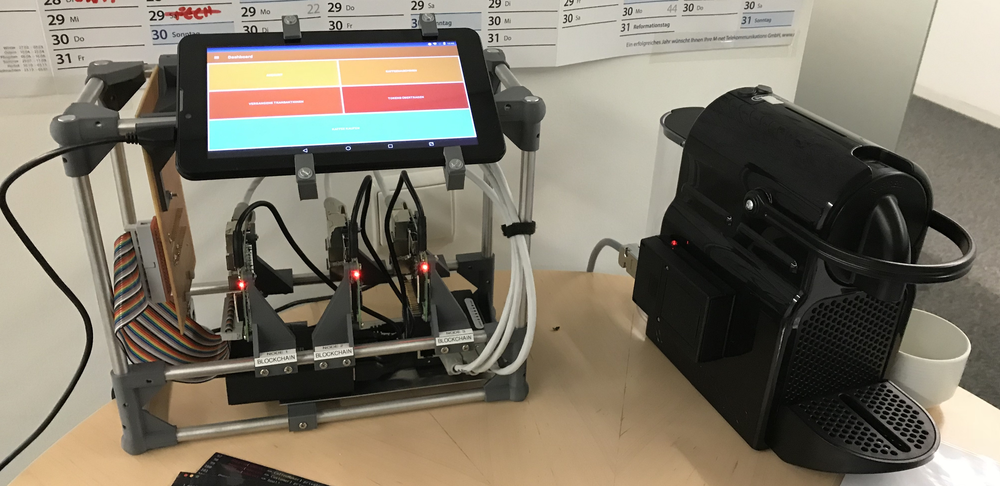

# CoffeeChain - An Ethereum Smart Contract Example

<p align="center">
    
</p>

## Table of Contents

- [Install](#install)
  - [Ethereum Tools on Ubuntu 16.04 LTS](#ethereum-tools-on-ubuntu-1604-lts)
  - [Geth on a RaspberryPi](#geth-on-a-raspberrypi)
- [Create Genesis File](#create-genesis-file)
  - [Genesis for Proof of Work (PoW)](#genesis-for-proof-of-work-pow)
  - [Genesis for Proof of Authority (PoA)](#genesis-for-proof-of-authority-poa)
- [Create the chain](#create-the-chain)
  - [Initialize the chain for each validator](#initialize-the-chain-for-each-validator)
  - [Start the first node](#start-the-first-node)
  - [Start the second node](#start-the-second-node)
- [Install the mist wallet application](#install-the-mist-wallet-application)
- [Deploy your first smart contract](#deploy-your-first-smart-contract)

## Install

### Ethereum Tools on Ubuntu 16.04 LTS
```
sudo apt-get install software-properties-common
sudo add-apt-repository -y ppa:ethereum/ethereum
sudo apt-get update
sudo apt-get install ethereum
```

### Geth on a RaspberryPi
1) Download the binary :
    ```
    curl https://gethstore.blob.core.windows.net/builds/geth-linux-arm7-1.8.6-12683fec.tar.gz --output geth-linux-arm7-1.8.6-12683fec.tar.gz
    ```

2) Unpack the archive:
    ```
    tar -xvzf geth-linux-arm7-1.8.6-12683fec.tar.gz
    ```

3) Move into the new directory and move the `geth` binary to `/usr/local/bin/`:
    ```
    cd geth-linux-arm7-1.8.6-12683fec/
    sudo mv geth /usr/local/bin/
    ```

## Create genesis file

### Genesis for Proof of Work (PoW)
Create a new file named `genesis.json` with the following contents:
```
{
    "config": {  
        "chainId": 987, 
        "homesteadBlock": 0,
        "eip155Block": 0,
        "eip158Block": 0
    },
    "difficulty": "0x400",
    "gasLimit": "0x8000000",
    "alloc": {}
}
```
The `chainId` may be any integer except one from the range `0-10` because these are the official network identifiers.

### Genesis for Proof of Authority (PoA)

#### First: create an account on each initial validation node (at least 2)
```
devsrv$ geth --datadir node1/ account new
Your new account is locked with a password. Please give a password. Do not forget this password.
Passphrase: pwdnode1
Repeat passphrase: pwdnode1
Address: {0x87366ef81db496edd0ea2055ca605e8686eec1e6}

devsrv$ geth --datadir node2/ account new
Your new account is locked with a password. Please give a password. Do not forget this password.
Passphrase: pwdnode2
Repeat passphrase: pwdnode2
Address: {08a58f09194e403d02a1928a7bf78646cfc260b0}
```

#### Second: store passwords in files to easily unlock the accounts later on
```
devsrv$ echo 'pwdnode1' > node1/password.txt
devsrv$ echo 'pwdnode2' > node2/password.txt
```

#### Third: create the genesis block
```
devsrv$ puppeth 
Please specify a network name to administer (no spaces, please)
> devnet
What would you like to do? (default = stats)
 1. Show network stats
 2. Configure new genesis
 3. Track new remote server
 4. Deploy network components
> 2

Which consensus engine to use? (default = clique)
 1. Ethash - proof-of-work
 2. Clique - proof-of-authority
> 2

How many seconds should blocks take? (default = 15)
> 5 // for example

Which accounts are allowed to seal? (mandatory at least one)
> 0x87366ef81db496edd0ea2055ca605e8686eec1e6 //copy paste from above
> 0x08a58f09194e403d02a1928a7bf78646cfc260b0

Which accounts should be pre-funded? (advisable at least one)
> 0x87366ef81db496edd0ea2055ca605e8686eec1e6 // free ethers :)
> 0x08a58f09194e403d02a1928a7bf78646cfc260b0

Specify your chain/network ID if you want an explicit one (default = random)
> 242 // for example; do not use anything from 1 to 10

Anything fun to embed into the genesis block? (max 32 bytes)
>

What would you like to do? (default = stats)
 1. Show network stats
 2. Manage existing genesis
 3. Track new remote server
 4. Deploy network components
> 2

1. Modify existing fork rules
 2. Export genesis configuration
> 2

Which file to save the genesis into? (default = devnet.json)
> genesis.json
INFO [01-23|15:16:17] Exported existing genesis block

What would you like to do? (default = stats)
 1. Show network stats
 2. Manage existing genesis
 3. Track new remote server
 4. Deploy network components
> ^C // ctrl+C to quit puppeth
```

## Create the chain

Copy the created `genesis.json` on each server you would like to create a validator node on. In this example we run both nodes on the same server, so this step is not necessary.

### Initialize the chain for each validator
```
devsrv$  geth --datadir node1/ init genesis.json
devsrv$  geth --datadir node2/ init genesis.json
```

### Start the first node
```
geth --identity "node1" --networkid 242 --datadir node1/ --unlock 0 --password "node1/password.txt" --mine console
```
Congratulations, you just started your first own Ethereum node. 👍

For reference, the parameter `--identity` gives a name to the node, the parameter `--unlock` selects the given account from the local account list (we only have one account per node, so the zero-based selection `0` is correct) and `--password` unlocks the selected account with the password from the given file. With `--mine` we also start mining immediately. The last parameter, `console`, gives us an administrative console for the node.

### Start the second node
Before we can start the second node, we need to get the enode address from the first node to be able to connect both nodes together. We can achieve this with `admin.nodeInfo.enode` or with `admin` to get some more details besides the `enode` address:
```
> admin.nodeInfo.enode
"enode://5e78262b450207237db480afa44616fcd00c1e84fdb25c22847a8f22e83fae702f5281af80fc8bd8447d26689e2bd88d53d6a50ca0ac10433ce482765fed80c5@[::]:30303"
```

In this string we still have to change the IP to the nodes actual IP, e.g. the local one in our case:
```
"enode://5e78262b450207237db480afa44616fcd00c1e84fdb25c22847a8f22e83fae702f5281af80fc8bd8447d26689e2bd88d53d6a50ca0ac10433ce482765fed80c5@192.168.1.10:30303"
```

We then save the data wrapped in a json array in a file named `static-nodes.json` in the folder `node2` (or on our second node server):
```
[
  "enode://5e78262b450207237db480afa44616fcd00c1e84fdb25c22847a8f22e83fae702f5281af80fc8bd8447d26689e2bd88d53d6a50ca0ac10433ce482765fed80c5@192.168.1.10:30303"
]
```

Now we can start the second node with:
```
geth --identity "node2" --networkid 242 --datadir node2/ --unlock 0 --password "node2/password.txt" --mine console
```

To check if both nodes are connected to each other, we can run:
```
> admin.peers
```
which should output something like this:
```
[{
    caps: ["eth/62", "eth/63"],
    id: "4af5bdfeab8751e610953b49b23a8ad4d3e7ddd3fa9f201f05a348eeaecf746d20427414e5beb0c166ca12b3aaf4a96cd38b29b2e34c4cccde43fb3feabc2292",
    name: "Geth/coffee_core/v1.8.7-stable-66432f38/linux-amd64/go1.10",
    network: {
      inbound: false,
      localAddress: "192.168.1.8:37084",
      remoteAddress: "192.168.1.165:30303",
      static: true,
      trusted: false
    },
    protocols: {
      eth: {
        difficulty: 89805,
        head: "0xffdd48d1927e932158381f6377e76d8208da2c2cb53d911f282033f1160a52c6",
        version: 63
      }
    }
}]
```

## Install the `mist` wallet application

The `mist` wallet application is available on github at https://github.com/ethereum/mist/releases.

To make it connect to your private chain, add above created `static-nodes.json` in the `.ethereum` directory (which is created during the installation of `mist`) and then start `mist`. You should see `Privat-Net` on the start up screen if everything worked out properly.

## Deploy your first smart contract

In your running `mist` instance, you can go to `Contracts` in the top menu and then click on `Create Contract`. Here you can copy the contents of `contracts/coffee_economy.sol`. After that you can deploy the contract on your blockchain. 👍
